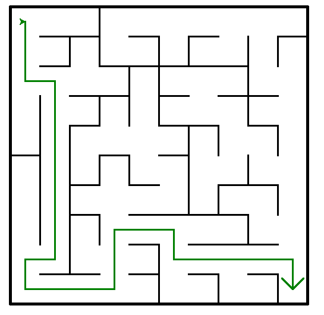
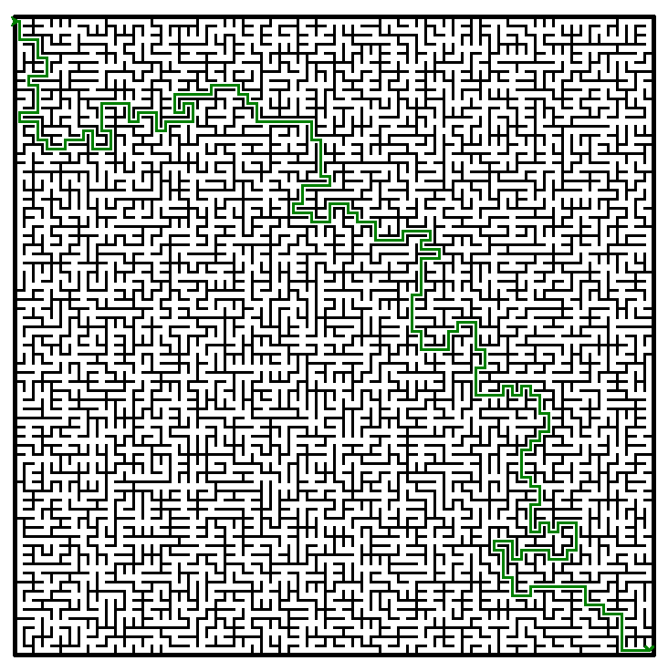
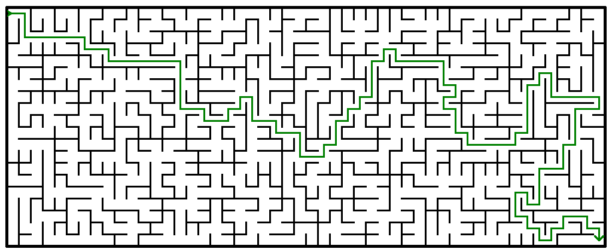

# Modélisation mathématique puis résolution d'un labyrinthe

## Auteurs
Kirill BIRYUKOV et Esteban PATTIN--BAS

Projet disponible sur https://github.com/k-3st3ban/NSI-laby

## Explication du projet
Ce code contient deux classes: `Pile` et `Laby`.

La classe `Pile` permet la création d'une pile, fondée sur une liste.

La classe `Laby` permet:
- la modélisation mathématique d'un labyrinthe par la méthode de fusion aléatoire de chemins
- la résolution du labyrinthe
- le traçage du labyrinthe et de sa résolution dans une fenêtre `turtle`

## Installation et lancement du programme
Seulement les librairies `random`, `turtle`, et `copy` sont nécessaires pour ce programme.

Pour tester le programme, il suffit de lancer `main.py`.

Voici les 2 seules lignes nécessaires à changer pour modifier le labyrinthe:
```
Labyrinthe = Laby(colonnes, lignes)
Labyrinthe.tracage_laby(Labyrinthe.resolve(entree, sortie), taille_trait)
```
Les arguments `entree`, `sortie`, et `taille_trait` sont optionnels.

Exemples de tests:
```
Labyrinthe = Laby(10, 10)
Labyrinthe.tracage_laby(Labyrinthe.resolve())
```
ou
```
Labyrinthe = Laby(50, 20)
Labyrinthe.tracage_laby(Labyrinthe.resolve(), 20)
```

## Tests au sein du programme
Des tests sont placés en commentaires en bas du programme:
- test d'un labyrinthe 10x10
- test d'un labyrinthe 70x70
- test d'un labyrinthe 50x20
- plusieurs tests d'un labyrinthe 12x12 avec entree et sortie bizarres
- plusieurs tests pour les erreurs de coordonnées (coordonnées qui sortent du labyrinthe, coordonnées similaires)

## Exemples visuels


